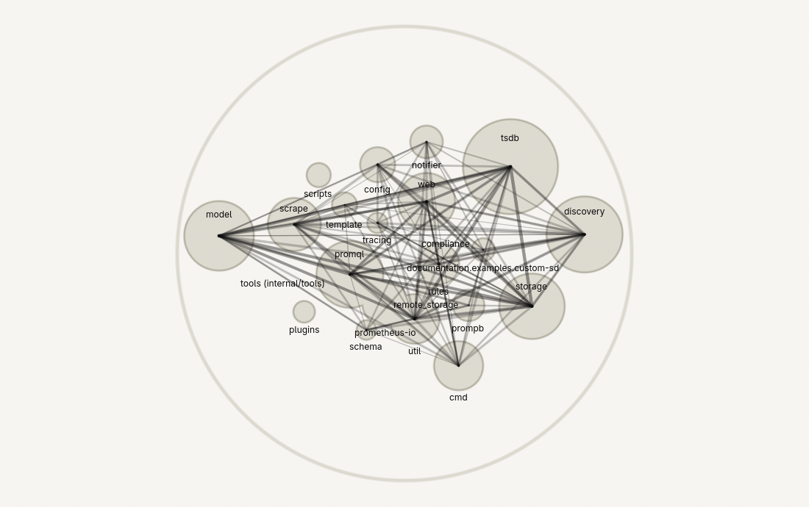
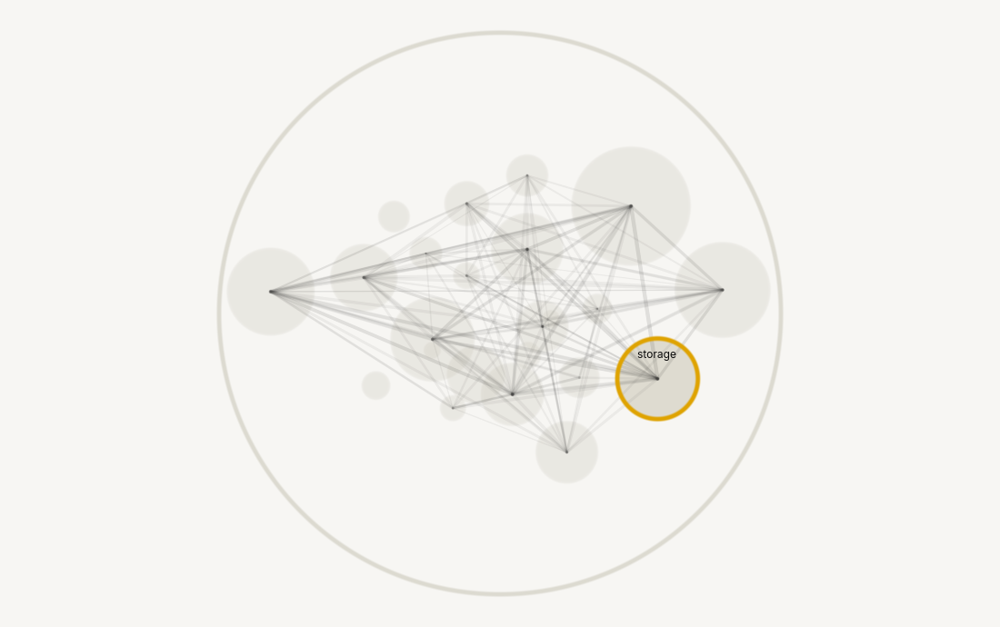
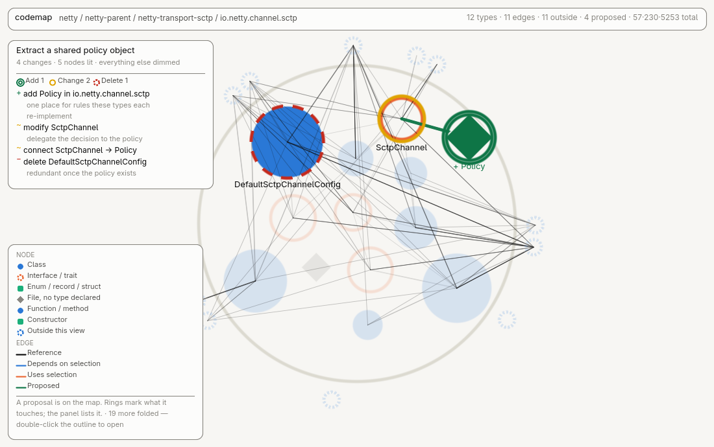
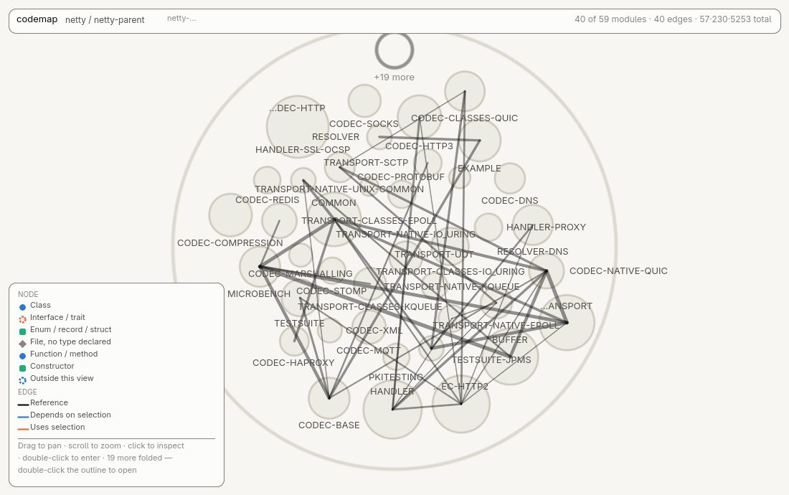
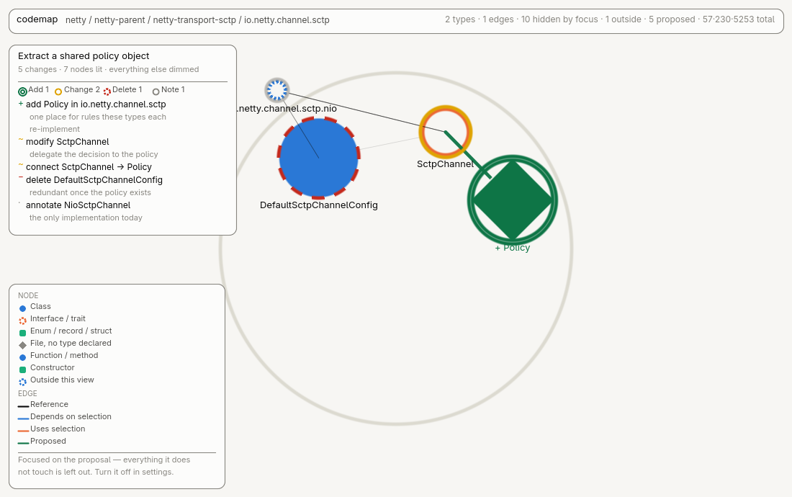
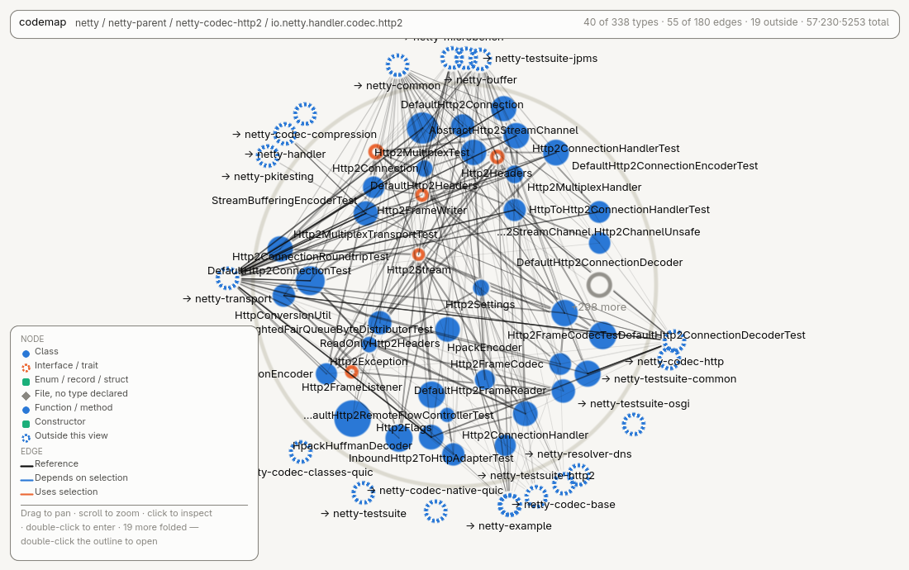

# codemap-mcp

**A live map of any codebase — and an MCP server that lets your coding agent draw its plan
on it before writing a line of code.**



Ask an agent to plan work and you get prose: *"add a shared policy object, have the channel
interface delegate to it, drop the default implementation"*. You approve it, and then find
out it touched three packages you weren't expecting. codemap gives the agent the map
instead. Additions turn **green**, changes **yellow**, deletions **red**, arrows show
connections it wants to create, and everything untouched fades into the background — so the
blast radius is visible from the project view before any code is written, and the panel on
the left says which change is which and why.

Nothing is persisted. A proposal is an overlay in memory; the graph stays a record of what
the code *is*.

```bash
curl -LO https://github.com/TobiasKP/codemap-mcp/releases/latest/download/codemap.jar

# 1. scan a project (any language) and open the map
java -jar codemap.jar /path/to/project --serve      # → http://localhost:7777

# 2. point your agent at it
java -jar codemap.jar mcp --port 7777               # stdio MCP, spawned by the client
```

One jar, no build, no runtime but a JVM 21+ — it bundles tree-sitter and all 14 grammars
with their native libraries for linux, macOS and Windows on x86-64 and arm64. Built from the
tagged commit by [CI](.github/workflows/release.yml), not uploaded from a laptop.
[All releases](../../releases). Or [build it yourself](#building-from-source) — it is three
commands.

MCP client config (`.mcp.json`, or your editor's equivalent):

```json
{
  "mcpServers": {
    "codemap": {
      "command": "java",
      "args": ["-jar", "/path/to/codemap.jar", "mcp", "--port", "7777"]
    }
  }
}
```

---

## Why this is not another code-city viewer

The map matters, but the map is the display surface. The thing that does not exist elsewhere
is the write side: an agent that has read the graph can *mark it up*, and what it marks up
is reviewable in seconds.

|  |  |
|---|---|
| A change buried in one package, seen from the project view — one of netty's 59 modules ringed, the rest faded, and the panel on the left saying what the change is |  |
| The same change three levels down: a new class as a green diamond, the interface it would be called from ringed amber, the class it replaces ringed dashed red |  |
| And the map on its own, with no proposal on it |  |

### Focus mode

The default keeps the untouched codebase around the change at 16% — you can see *where* in
the system the plan lands. Turn on **Focus on the change while planning** (⚙, top right) and
everything the proposal does not touch is left out instead of faded: the entities in play,
the edges between them whether proposed or already there, and nothing else.

| default — context kept | focused — same view, same framing |
|---|---|
|  |  |

`12 types · 11 edges` becomes `2 types · 1 edges · 10 hidden by focus`. Two things make it
usable rather than disorienting:

- **Containers on the path down are kept.** Their status is rolled up from the change below
  them, so the top view still shows which module to open. Dropping them would empty the
  upper levels and leave no way to reach the change — the opposite of focusing on it.
- **The view still frames on the whole container.** The change appears where it actually
  lives, and the empty space is honest: the rest of the package is there, it is just not
  drawn. Framing on the two survivors instead would zoom until they overflowed the screen.

Settings live in a `settings` table in the graph database, and a rescan carries them over —
everything else in that file is derived from source and gets rewritten, but a setting is the
one thing in there a person chose.

Every status is carried by **colour, ring texture and a word** — doubled ring for an
addition, solid for a change, dashed for a deletion, each spelled out in the panel. Green
and red are the one pair hue cannot separate for a red-green colour blind reader, or in
print, so hue is never the only channel.

### What the graph says back

Everything above draws the plan faithfully, which means it draws a bad plan just as
convincingly as a good one. Two things on the map are *not* the agent's account of its own
work — they come from the scan, and they are the only parts that can disagree with it.

**Precedent.** Every proposed dependency arrives with the number of times the codebase
already makes the same trip, counted between the two containers the edge actually crosses:

```
connect TextbausteinService → parseSummaryText
  ⚠ against the grain (19:1 the other way)        529 exist this way, 10251 the other
connect TextbausteinButtonProvider → TextbausteinService
  ⌀ follows 10251 existing
connect TextbausteinService → SummaryRelevantServiceFacade
  ⌀ inside de.itc.onkostar.verwaltung
```

Same three green arrows on the map, and three completely different decisions. A call that
joins ten thousand existing references is a mechanical consequence; the first edge from A to
B is an architectural choice somebody made in passing.

**Exposure.** What the plan changes that has users the plan never mentions — the shape of an
incomplete plan, and invisible on a map that only draws what it was told. It reads as a short
list above the change list, one line each, clickable:

```
LOOK CLOSER AT
• Kontext · 34 users, none in the plan
```

This was a violet ring on the map once. It came off: exposure is scattered by nature — those
34 callers land in a dozen packages — so painting it lit half the screen at every level and
drowned out the change it was meant to qualify. The finding was real, the ink was noise.
Violet stays as **text only, never on the canvas**, and the count sits in the status line
(`34 not addressed`) where collapsing the panel cannot dismiss it. `get_proposal` reports it
too, so an agent can answer for its own omissions before a human ever looks.

Neither needs a model, another scan, or a config file: precedent is a rolled-up edge already
in the table, and exposure is the reverse of the edges used to draw the view.

## The MCP tools

| Reading | |
|---|---|
| `get_tree(ref?, depth?, width?)` | the containment tree, wide levels truncated largest-first |
| `get_node(ref)` | kind, language, path, lines, degrees, the files it is made of, its ancestors |
| `get_children(ref)` | one level down, whatever layer that is |
| `get_relationships(ref, direction?)` | resolved dependencies both ways, with kind and weight |
| `find(query)` | search by name when you do not know where something lives |

| Drawing | |
|---|---|
| `start_proposal(title)` | begin; clears the previous one |
| `propose_add(parent, name, kind?, note?)` | a new node — **green**. Returns a ref to build on |
| `propose_modify(target, note)` | an existing node changes — **yellow** |
| `propose_delete(target, note?)` | it goes — **red** |
| `propose_move(target, new_parent, note?)` | yellow where it is, green where it lands |
| `propose_connection(from, to, kind?, note?)` | an arrow, tapering towards what it would use |
| `annotate(target, note)` | a finding, not a change — grey |
| `highlight(targets, note?)` | light up a set: every caller, every class to touch |
| `get_proposal()` / `clear_proposal()` | read it back, or withdraw it |

`ref` is forgiving: a node id, a fully qualified name, a plain class name if it is unique,
or a ref handed back by `propose_add`. A plain name resolves to the *outermost* thing
carrying it — in most languages a class shares its name with its own constructor, so
`Invoice` is the class. Two classes called `Invoice` in different modules is genuinely
ambiguous and is refused, naming both, rather than guessed at.

A change is rolled up its ancestor chain, which is what makes it visible from the top: a
container shows the one thing happening inside it, or yellow when several different things
are, and is never marked as *changed itself* just because something inside it is.

## What it maps

Four layers, each a rollup of the one below:

| Layer | Node | Edge |
|---|---|---|
| 1 · module | a build unit: maven module, cmake target, npm package, cargo crate, csproj, go module | the dependency, declared in the build file or implied by code crossing the boundary |
| 2 · package | the declared package or namespace; the directory where the language has no such concept | a type in one reaching into the other |
| 3 · type | class, interface, enum, record, struct, or the file itself where no type is declared | one type using another |
| 4 · function | a method, constructor or free function | one calling the other |

Every edge keeps the breakdown that produced it (`CALL:11,FIELD:3`), so you can see *why*
two things are connected, not just that they are.

**Nothing is inferred or guessed.** Only syntax facts, resolved symbols and directly
declared dependencies become edges. `extends` / `implements`, a field of that type,
`new Target(...)`, a call on a receiver whose type resolved, and a type name in any type
position. A reference is resolved by qualification, then imports, then same package, then
siblings, then includes/relative imports, then a unique simple name — and **dropped if none
of that lands**. A wrong edge on a dependency map is worse than a missing one. References
never cross language families either, so a Java reference to `Context` will not match a
`Context.js` that merely shares a name.

A C++ class is one node even though it lives in two files: an implementation file that
declares nothing of its own but defines members of a type declared elsewhere
(`void Facade::run()`) is attributed to that type and contributes its lines to it. The two
files stay individually visible in the detail panel. The same applies to Rust `impl` blocks.

### Languages

Full support, with a tree-sitter grammar and its own query set: **Java, C, C++, C#, Python,
JavaScript, TypeScript, Go, Rust, Kotlin, Scala, Swift, PHP, Ruby**.

Files in a language without a grammar still become nodes so the map stays complete — they
just contribute no edges. Adding a language is one entry in `LanguageRegistry` plus its
grammar jar; nothing else in the pipeline is language aware.

## Reading the map

One container at a time, the way a folder view does. Containment is a tree with no fixed
depth:

```
project ─▶ module ─▶ name-path group ─▶ … ─▶ package ─▶ class ─▶ function
```

Double-click to open, `Backspace` to go up, `f` to refit, `e` for every edge,
`p` to fold the plan panel away, `/` to search.
A package holding both sub-packages and its own classes shows both, as a folder shows
folders and files.

- **Packages are grouped by their name path**, which is what makes a large project
  navigable: a module with hundreds of packages is not a view anyone can read, but those
  packages are not really flat — `…reporting.editor` sits under `…reporting`. Grouping on
  the path turns a flat list into a handful of siblings, and again at each step down. Levels
  that neither hold code nor branch are collapsed, so you never click through `com` →
  `com.example` → `com.example.app`. On the netty scan above that leaves **4,478 of 4,790
  views with 25 or fewer children**.
- **The tail of a wide view is folded, and the tail of a dense one is thinned.** Grouping
  cannot help a package that genuinely holds 338 types — that is real breadth. So a view
  draws the 40 entities that carry it and puts the rest behind one `+298 more` outline you
  can open. Edges get the same treatment for a different reason: dependency weight is
  brutally skewed, so drawing **31% of netty's `codec.http2` edges keeps 85% of the total
  weight**. Press `e` for all of them, or hover an entity to get its own back. Every entity
  keeps its single heaviest link whatever the threshold says, so nothing is ever drawn as
  isolated when it is not.
  Both truncations are stated in the status line — `40 of 338 types · 55 of 180 edges` —
  because a silent cap reads as "this is everything". Neither ever hides something a
  proposal touches: importance measures how much of the codebase an entity carries, which
  has nothing to do with whether someone is about to change it.

  
- Anything a view depends on that lives **outside** it appears as a **dashed entity on the
  rim**, placed in the direction that thing actually lies — double-click it and you are
  there.
- Labels are budgeted, not exhaustive: the most important entities are named until the
  screen is full, placement uses each label's measured rectangle so they never overlap, and
  the prefix every name shares is shown once in the header instead of on all of them.
- Identity is carried by colour *and* shape — circle for a class, ring for an interface,
  square for enum/record/struct, diamond for a plain file.
- Dark and light are each selected against their own surface, not flipped.

Layers 1 and 2 load up front; a module's types are fetched the first time you open into it,
and a type's functions the first time you open into that. Each view is laid out and framed
on its own contents, so sizes are comparable *within* a view. Layouts are deterministic — an
entity keeps its position between visits.

If the map is ever blank, open `?diag=1`. It prints what the renderer actually sees: canvas
size, device pixel ratio, theme, level, camera, buffer counts, the WebGL renderer string and
`gl.getError()` — which distinguish "no data" from "empty buffers" from "wrong camera", all
of which look identical on screen.

## CLI

```
codemap <project-path> [options]     scan, and optionally serve
codemap serve <graph.db> [--port N]  serve a graph you already scanned
codemap mcp [--port N]               stdio MCP server, talking to a running serve
```

| Option | |
|---|---|
| `--db <file>` | where to write the graph (default `graphs/<name>.db`) |
| `--name <name>` | project name shown on the map |
| `--serve` | serve the map once the scan finishes |
| `--port <n>` | http port (default 7777) |
| `--threads <n>` | parser threads (default: cores − 1) |
| `--exclude <frag>` | skip paths containing this fragment (repeatable) |
| `--include-dir <name>` | stop ignoring a directory, e.g. `--include-dir build` |
| `--max-file-size <n>` | skip files larger than n bytes (default 2000000) |
| `--no-layout` | skip the layout pass |
| `--verbose` | report parse failures and rejected query patterns |

## HTTP API

The viewer is a client of this, and so is the MCP server.

| Endpoint | Returns |
|---|---|
| `GET /api/meta` | scan summary, layer counts, bounds |
| `GET /api/graph?layer=1\|2` | every node and edge of that layer |
| `GET /api/graph?layer=N&parent=<id>` | the children of one node, plus stubs for edge endpoints outside |
| `GET /api/node?id=<id>` | one node, its ancestors, and its neighbours both ways |
| `GET /api/children?ref=<ref>` | what is directly inside a node |
| `GET /api/tree?ref=&depth=&width=` | the containment tree, nested |
| `GET /api/resolve?ref=<ref>` | id, name, qname and layer for any reference form |
| `GET /api/search?q=<term>` | matching nodes across all layers |
| `GET /api/settings` | user settings |
| `POST /api/settings` | `{"key","value"}` — one setting, persisted |
| `GET /api/proposal?since=<rev>` | the overlay; a matching revision answers `{"unchanged":true}` |
| `POST /api/proposal/start` | `{"title"}` |
| `POST /api/proposal/change` | one operation |
| `DELETE /api/proposal` | withdraw the overlay |

## Schema

Two tables, as intended: everything the frontend draws is a row in one of them.

```sql
nodes(id, layer, kind, name, qname, parent_id, path, lang, loc, x, y, r,
      in_deg, out_deg, children, files)
edges(id, layer, src_id, dst_id, kind, weight, breakdown, parent_id)
meta(key, value)          -- what the scan found; replaced by the next one
settings(key, value)      -- what the user chose; carried across a rescan
```

`files` packs one line per contributing file (`role<TAB>lines<TAB>path`). An edge's
`parent_id` is the view it belongs to — the nearest common ancestor of its endpoints — which
is what makes drawing a level a filter rather than a search. Ids are assigned per layer
sorted by qname, so a rescan of unchanged source produces the same ids.

## Building from source

```bash
mvn package                 # → target/codemap.jar
```

Or without Maven:

```bash
tools/fetch-deps.sh         # jars into lib/, once
./build.sh                  # → out/classes
tools/package.sh            # → dist/codemap.jar
```

## Tests

There is no browser in this project's CI, and the interesting bugs are visual, so the
harness works from the other side: it runs the real `app.js` in a stub DOM against a stub
WebGL2 context and asserts on the instance buffers it actually produced.

```bash
tools/graph-checks.sh                          # scanner invariants, on a C++/JS fixture
tools/mcp-checks.sh                            # a whole MCP session, plus: nothing persisted
tools/shader-check.sh                          # every GLSL program, via glslangValidator
node tools/frontend-smoke.mjs http://localhost:7777
node tools/preview.mjs --url http://localhost:7777 --zoom package --out map.png
node tools/demo-gif.mjs --url http://localhost:7777 --out docs/demo.gif
```

`preview.mjs` and `demo-gif.mjs` rasterise the app's own instance buffers through the app's
own `worldToScreen()`, with the pass order living in one place (`tools/raster.mjs`). That
covers everything on the CPU side of the GPU boundary; the shaders are covered separately,
because the rasteriser is blind by construction to a vertex shader that disagrees with
`worldToScreen()` — the smoke test catches that with a source check instead.

## Layout of the source

```
src/main/java/io/github/tobiaskp/codemap/
  Main.java            cli
  detect/              layer 1: find modules in whatever build files exist
  scan/                walk the tree, parse each file with tree-sitter into FileFacts
  resolve/             the index of everything the project declares
  graph/               resolve references, build layer 3, roll up to 2 and 1
  layout/              force-directed placement, one independent layout per view
  store/               the SQLite schema and writer
  serve/               http server, json api, and the proposal overlay
  proposal/            a proposed change — in memory, never persisted
  mcp/                 the stdio MCP server and its tool definitions
src/main/resources/web/  index.html + app.js (the WebGL viewer)
```

## Licence

MIT — see [LICENSE](LICENSE). Runtime dependencies and their terms are listed in
[THIRD-PARTY.md](THIRD-PARTY.md).

The demo above maps [netty](https://github.com/netty/netty) — 57 modules, 5,253 types. The
proposal drawn on it is invented for the animation, not a real suggestion about that
project.
